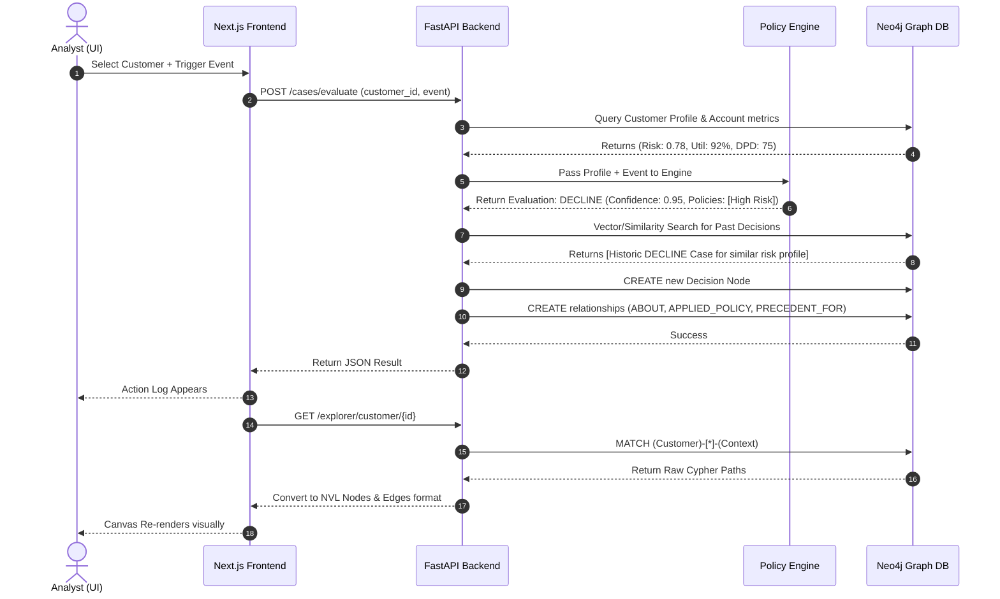
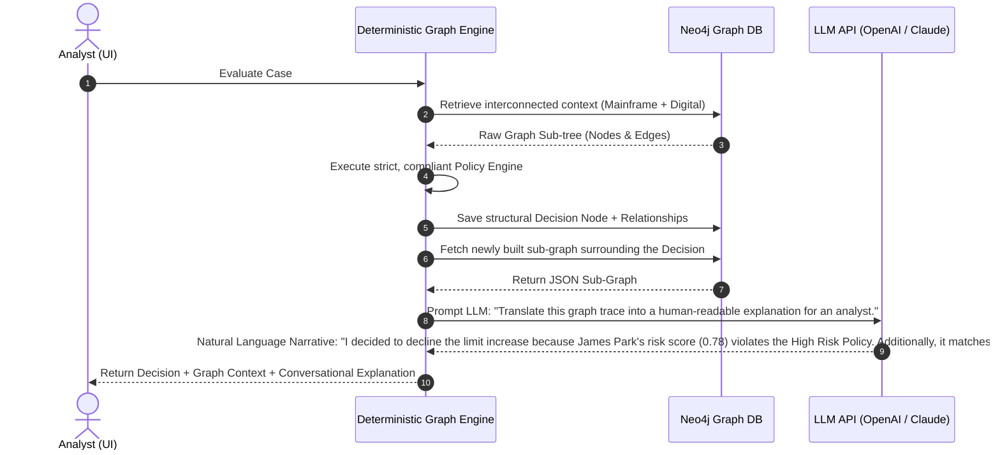

# NBA-Demo Architecture & Data Flow

This document outlines how the Next Best Action (NBA) engine processes data from the moment you click "Trigger Evaluation" in the UI to the rendering of the Context Graph.

## 1. System Components & Database

| Component | Technology | Role |
| :--- | :--- | :--- |
| **Database** | **Neo4j 5.x** | A native Graph Database. We use it to store everything: Customer profiles, Accounts, Policies, and historical Decisions. Using a graph DB allows us to traverse complex relationships (e.g., *Find all approved credit limits for standard customers with similar risk profiles*). |
| **Backend** | **Python (FastAPI)** | The core logic engine. It manages the REST API endpoints, connects to Neo4j via the official Python driver, and evaluates the deterministic business rules. |
| **Frontend** | **Next.js (React)** | The presentation layer containing the 3-pane Explorer, communicating with the backend via standard HTTP JSON requests. |

## 2. Our Data Sources (Mock Data)

Even though this is a demo, the data is structured exactly how it would be in an enterprise environment:

1. **CRM / Core Banking Data (Customers & Accounts)**:
   - *Mock Implementation*: Seeded directly into Neo4j via `seed.cypher` during startup.
   - *Data*: Attributes like `risk_score` (0.0 to 1.0), `credit_score` (300-850), `segment` (premium/standard), and `months_active`.
2. **Business Rules (Policies)**:
   - *Mock Implementation*: Hard-coded inside `policy_engine.py` using standard `if/else` deterministic logic, but represented visually in Neo4j as `Policy` nodes.
3. **Historical Decisions (Precedents)**:
   - *Mock Implementation*: Pre-seeded past decision nodes in Neo4j.
   - *Usage*: The backend uses a similarity scoring algorithm to find past decisions that match the current customer's profile to justify the current recommendation.

---

## 3. The Sequence of Data Flow (Deterministic)

When you select a customer, choose an event, and click **Trigger Evaluation**, here is exactly how the data flows through the deterministic system.

---

## 4. Traditional NBA vs Context-Graph NBA

Credit card companies often rely on legacy infrastructures (Mainframes for transaction processing, separate digital DBs for CRM, and static data warehouses for reporting). Because these architectures are siloed, their Next Best Action engines run into massive limitations.

### Traditional NBA Engines (System of Record for "What")
* **Flat State**: They pull data from various APIs (Mainframe APIs, CRM APIs), run a rules engine or predictive model in memory, spit out a decision (e.g., "Decline Credit Increase"), and write the *result* to a log.
* **Loss of Context**: Once the decision is made, the live state of the data sources at that exact millisecond is lost. 
* **The "Why" is Missing**: If an auditor or analyst asks, "Why did we make this decision 3 weeks ago?", engineering has to dig through disconnected application logs, essentially guessing the state of the mainframe at the time.

### Context-Graph NBA (System of Record for "What" AND "Why")
* **Unified Topology**: By pulling mainframe metrics and CRM boundaries into a Graph Database, you represent all interconnected real-world entities (Customer → Account → Transaction Cluster).
* **Decisions are Connected Nodes, not Logs**: When our Context Engine makes a decision, it permanently injects a `(Decision)` node directly into the graph.
* **Traceable Justification**: The `(Decision)` doesn't just hold the outcome; it physically links to the `(Policy)` node that triggered it, and the `(Context)` snapshot of the account at that exact moment. 
* **Result**: An analyst can instantly see the exact web of reasons, rules, and exceptions that caused the decision, effectively becoming a system of record for the *Context* of the decision.

---

## 5. Upcoming: LLM Integration overlaying the Context Graph

Because the Context Graph explicitly maps out the "Why", it creates the perfect foundation for Generative AI. 

Instead of relying on an LLM to probabilistically *make* the credit decision (which is risky and non-compliant), we use the deterministic rules engine to make the decision, and use the LLM to **synthesize the graph narrative**. This provides a 100% compliant, explainable AI interface.

### Benefits of this Approach:
1. **No Hallucinations**: The LLM acts purely as an interpreter of the Graph text. It cannot invent new rules or make the wrong decision.
2. **Explainability**: The LLM writes a cohesive narrative specifically tailored to the human analyst, pointing them exactly to the nodes they need to check in the UI Canvas.
